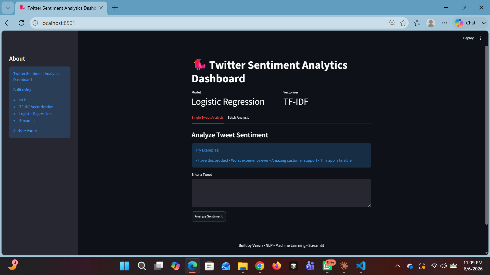
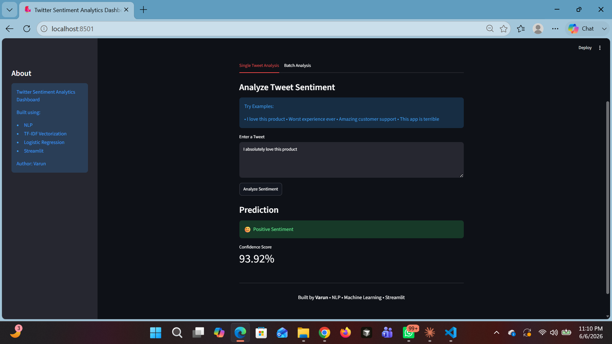
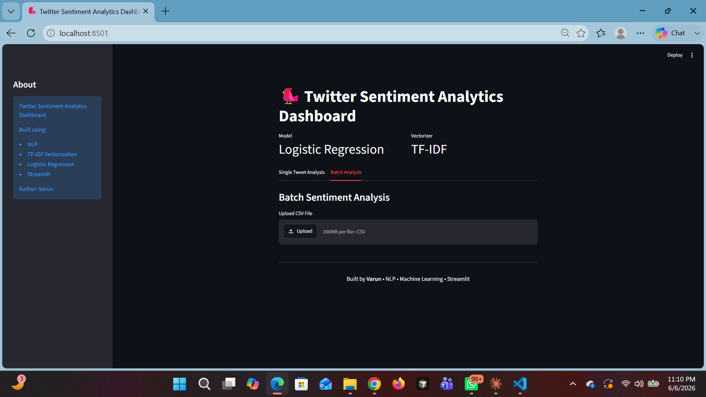
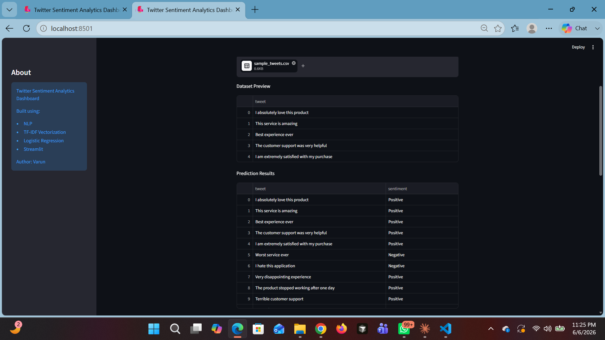
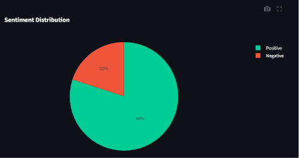
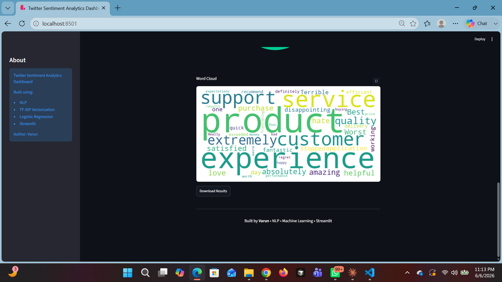

# 🐦 Twitter Sentiment Analytics Dashboard

## Dashboard Home

## Single Tweet Prediction

## Batch Analysis

## Batch Prediction

## Sentiment Distribution

## Word Cloud

## Project Structure

- Streamlit Dashboard (`app.py`)
- Trained Logistic Regression Model
- TF-IDF Vectorizer
- Jupyter Notebook for Model Development
- Interactive Visualizations
